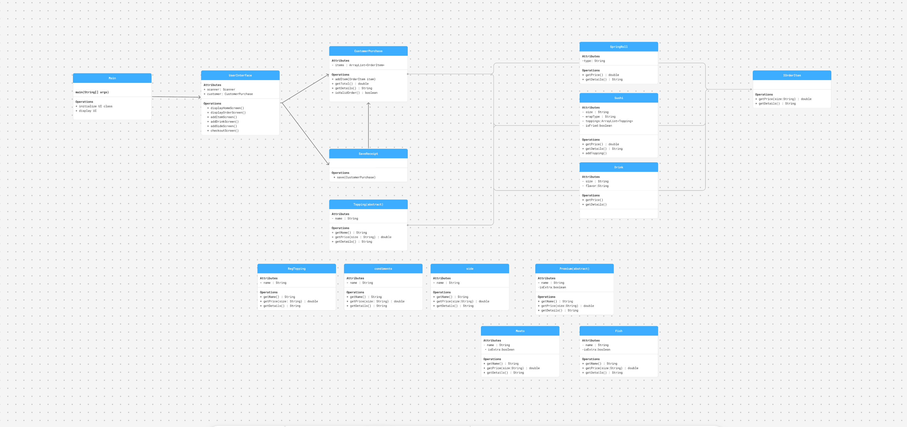

# Sushi Craft
diagram

## Description of the Project

My project is a custom point-of-sale application for a sushi shop. 
The application allows customers to build a custom sushi order by choosing a sushi size, wrap type, toppings, 
premium toppings, and special options. 
Customers can also add drinks and sides to their order. The program will calculate the
total price, display a full order summary for review, 
and save the completed order as a receipt file named with the date and time of the order.
## User Stories

- As a customer, I want to start a new order so that I can begin purchasing items from the sushi shop.
- As a customer, I want to add a sushi item to my order so that I can customize and buy sushi.
- As a customer, I want to choose the size of my sushi item so that I can order the amount of food I want.
- As a customer, I want to choose the wrap type for my sushi so that I can customize the base of my item.
- As a customer, I want to add regular toppings to my sushi so that I can customize the flavor of my order.
- As a customer, I want to add premium toppings such as meat or fish so that I can make my sushi more filling, even if it costs extra.
- As a customer, I want to choose a special option for my sushi so that I can further customize my item.
- As a customer, I want to add drinks or sides to my order so that I can complete my meal.
- As a customer, I want to view my full order details before checkout so that I can make sure my order is correct.
- As a customer, I want my receipt to be saved after checkout so that there is a record of my completed order.
## Setup

Instructions on how to set up and run the project using IntelliJ IDEA.

### Prerequisites

- IntelliJ IDEA installed
- Java SDK installed and configured

### Running the Application in IntelliJ

1. Open IntelliJ IDEA.
2. Select **Open** and navigate to the project folder.
3. Wait for IntelliJ to index the files and configure the project.
4. Find the main class that says Contract
## Technologies Used

- Java: Mention the version you are using.
- Any additional libraries or frameworks used in the project.

## Demo

Include screenshots or GIFs that show your application in action. Use tools like [Giphy Capture](https://giphy.com/apps/giphycapture) to record a GIF of your application.

## Future Work

Potential future enhancements or functionalities I would consider adding:

- Add stronger input validation to prevent errors when users enter invalid menu choices or unexpected input.
- Add the ability to remove items from the cart before checkout.
- Add the ability to update an existing sushi roll, drink, or side item after it has been added to the cart.
- Improve receipt formatting so item details, prices, and totals display neatly with two decimal places.
- Add saved receipt history so users can view past orders from inside the application.
- Add more preset sushi roll options, including Brazilian-style sushi combinations.****
## Resources

List resources such as tutorials, articles, or documentation that helped you during the project.

- Java Documentation
- Java File I/O tutorials
- Java Collections Framework — ArrayList used for vehicle inventory management.
- IntelliJ IDEA
- Class notes and project instructions

## Team Members

- Gwamaka Mwamtobe

## Thanks

Express gratitude towards those who provided help, guidance, or resources:

- Thank you to Raymond for continuous support and guidance.